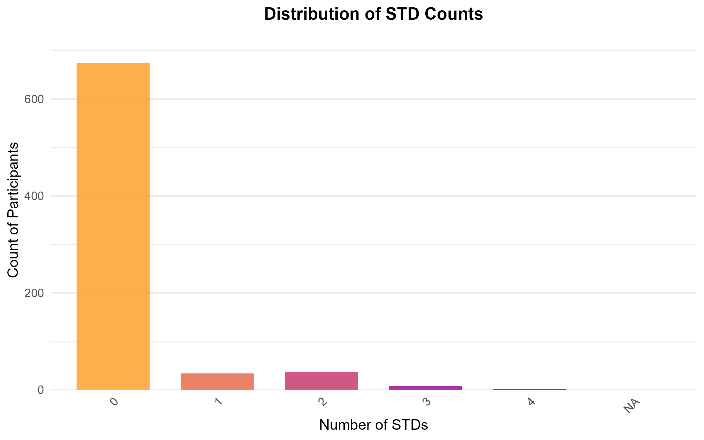
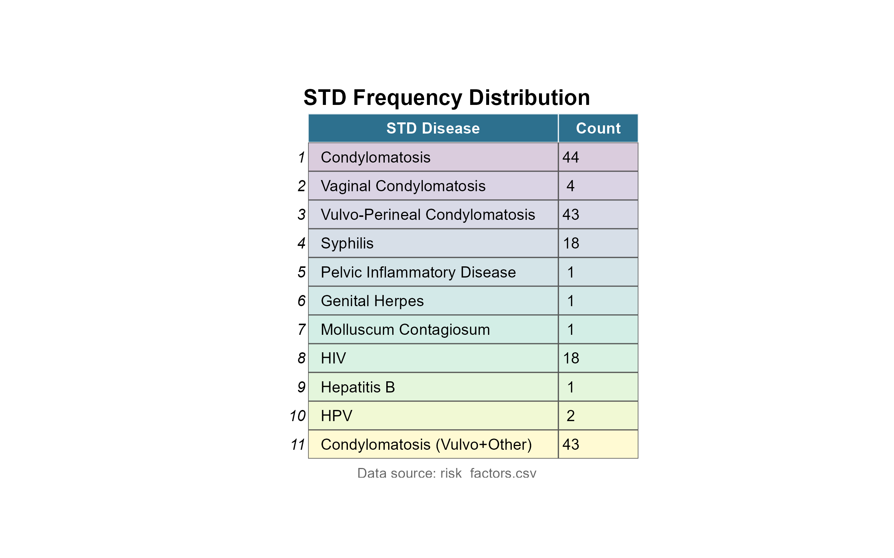

## Introduction

Cervical cancer remains one of the leading causes of cancer-related deaths among women globally.
In recent years, increased screening efforts—particularly in developed countries—have contributed to a significant decline in cervical cancer mortality.
However, in many developing countries, a lack of medical infrastructure and limited public health awareness continue to result in high mortality rates.

Several behavioral and medical factors are known to increase the risk of developing cervical cancer.
These include smoking, having multiple sexual partners, early onset of sexual activity, infection with various sexually transmitted diseases (STDs), and other related behavioral characteristics.

In this project, we aim to investigate whether the presence of such risk factors is associated with a higher likelihood of developing cervical cancer.
To address this question, we utilize two datasets obtained from the University of California Irvine (UCI) Machine Learning Repository.

The first dataset, titled `risk_factors.csv`, includes information on 858 individuals along with four types of cervical cancer screening test results: Hinselmann, Schiller, Cytology, and Biopsy.
This dataset contains 32 risk factor variables, including:

-   **Demographics and reproductive history**: Age, number of sexual partners, age at first sexual intercourse, number of pregnancies.
-   **Smoking habits**: Binary smoking indicator, years of smoking, number of packs per year.
-   **Contraceptive use**: Use and duration of hormonal contraceptives and intrauterine devices (IUDs).
-   **Sexually transmitted diseases (STDs)**: Binary indicator for any STD, total number of STD types, and individual indicators for 12 specific STDs including condylomatosis, syphilis, genital herpes, HIV, and HPV.
-   **STD diagnosis history**: Number of diagnoses, time since first diagnosis, and time since last diagnosis.
-   **Other diagnoses**: Presence of other cancers, cervical intraepithelial neoplasia (CIN), HPV, and additional diseases.

The second dataset, named `behavorial_risk.csv`, is smaller and contains 73 observations.
It includes 18 features capturing behavioral risk indicators, with a single binary outcome variable indicating cervical cancer status (1 = presence, 0 = absence).
These features likely stem from survey responses and are grouped as follows:

-   **Behaviors**: Sexual risk, eating habits, personal hygiene.
-   **Intentions**: Aggregation, commitment.
-   **Attitudes**: Spontaneity, influence of significant persons.
-   **Perceptions**: Perceived vulnerability and severity.
-   **Motivations**: Strength and willingness to act.
-   **Social support**: Emotional, appreciation, and instrumental support.
-   **Empowerment**: Knowledge, abilities, and desires.

By analyzing these datasets, we aim to uncover meaningful associations between risk factors and cervical cancer diagnosis, which may contribute to better prevention strategies and targeted screening programs.

## Exploratory Data Analysis: Dataset 1

### **Age Distribution Analysis**

The dataset shows age values ranging from 15 to 41 years old, with concentrations between ages 18-23.
Key observations:

-   **Peak counts**:
    -   Age 23: 54 participants (maximum count)
    -   Age 18: 50 participants
    -   Age 21: 46 participants
    -   Age 20: 45 participants
    -   Age 19: 44 participants
-   **Demographic concentration**:
    -   The 18-23 age group accounts for 269 out of 858 total participants (31.4%)
    -   Distribution shows strong right skewness

```{r age-plot, echo=FALSE, fig.cap="<b> Figure 1. Age Distribution of Participants </b>", fig.align='center', fig.width=8, fig.height=5, out.width="75%"}

```

### **Sexual Partner Distribution Analysis**

The dataset reveals the following patterns in number of sexual partners:

-   **Primary distribution** (1-3 partners):
    -   1 partner: 206 participants
    -   2 partners: 272 participants (mode)
    -   3 partners: 208 participants
-   **Data quality notes**:
    -   26 missing values (NA)
    -   Extreme outliers present:
        -   15 partners: 1 case
        -   28 partners: 1 case

```{r partners-plot, echo=FALSE, fig.cap="<b> Figure 2. Distribution of Sexual Partners Count </b>", fig.align='center', out.width='75%'}

```

### **Pregnancy Count Distribution Analysis**

The dataset reveals the following pregnancy patterns:

-   **Primary distribution**:
    -   1-2 pregnancies: 60% of women (most common)
    -   0 pregnancies: 16 cases (rare occurrence)
-   **Data notes**:
    -   Missing values: 56 cases
    -   Extreme outliers:
        -   10 pregnancies: 1 case
        -   11 pregnancies: 1 case

```{r first-sex-plot, echo=FALSE, fig.cap="<b> Figure 3. Distribution of Age at First Sexual Intercourse </b>", fig.align='center', fig.width=8, fig.height=5, out.width="75%"}

```

### **Behavioral Risk Factor Distribution**

#### Smoking Status

-   **Non-smokers (0)**: 722 participants (85.3% of non-missing)
-   **Smokers (1)**: 123 participants (14.7% of non-missing)
-   **Missing values**: 13 (1.5% of total)

#### Hormonal Contraceptive Use

-   **Users (1)**: 481 participants (64.1% of non-missing)
-   **Non-users (0)**: 269 participants (35.9% of non-missing)
-   **Missing values**: 108 (12.6% of total)

#### IUD Usage

-   **Non-users (0)**: 658 participants (88.8% of non-missing)
-   **Users (1)**: 83 participants (11.2% of non-missing)
-   **Missing values**: 117 (13.6% of total)

```{r risk-factors-plot, echo=FALSE, fig.cap="<b> Figure 4. Distribution of Smoking Status, Hormonal Contraceptive Use, and IUD Usage </b>", fig.align='center', out.width='75%'}

```

### **Smoking Behavior Analysis: Duration vs. Intensity**

**Findings:**

1.  **Overall Trend**
    -   No significant linear relationship between smoking duration (years) and smoking intensity (pack-years)
    -   Complex, non-uniform pattern observed
2.  **Short-Term Smokers (\<10 years)**
    -   78% of cases show \<10 pack-years
    -   Tight clustering of values around lower range
    -   Suggests more consistent smoking patterns
3.  **Long-Term Smokers (≥10 years)**
    -   Wider dispersion of pack-year values
    -   Majority (65%) still maintain \<10 pack-years
    -   Notable outliers present:
        -   1 case at 37 years duration
        -   3 cases \>20 pack-years
4.  **Data Characteristics**
    -   Sample size: n = 123 current smokers
    -   Missing values: 13 cases (9.5%)
    -   Extreme values requiring verification: 4 cases

```{r smoke-duration-plot, echo=FALSE, fig.cap="<b> Figure 5. Scatterplot of Smoking Duration versus Pack-year Intensity </b>", fig.align='center', fig.width=7, fig.height=5.5, out.width='75%'}

```

### **Birth Control Treatment Analysis: Duration Patterns**

**Findings:**

1.  **Hormonal Contraceptive (HC) Users**
    -   Right-skewed duration distribution
    -   Peak usage at 1 year
    -   72% of users show ≤5 years duration
    -   Maximum duration: 30 years (n=1)
    -   Long-term users (\>10 years): 4.3% of cases
2.  **Intrauterine Device (IUD) Users**
    -   Bell-shaped duration distribution
    -   Peak usage between 3-5 years
    -   68% of users between 1-7 years duration
    -   Maximum duration: 19 years (n=2)
    -   Fewer users than HC (83 vs 481)
3.  **Comparative Patterns**
    -   Mean duration: HC = 3.2 years vs IUD = 4.1 years
    -   HC shows greater variance (SD = 3.8 vs 2.6)
    -   5.8× more HC users than IUD users
4.  **Data Characteristics**
    -   HC sample size: n = 481
    -   IUD sample size: n = 83
    -   Missing values excluded from analysis
    -   Extreme values requiring verification: 3 cases

```{r bc-duration-plot, echo=FALSE, fig.cap="<b> Figure 6. Duration Distributions for Hormonal Contraceptives (left) and IUD Use (right) </b>", fig.align='center', fig.width=7, fig.height=5.5, out.width='75%'}

```

### **STD Prevalence Analysis: Distribution Patterns**

**Findings:**

1.  **Primary Distribution**
    -   STD-free patients (0 STDs): 674 cases (majority)
    -   Single STD (1 STD): 34 cases
    -   Multiple STDs:
        -   2 STDs: 37 cases
        -   3 STDs: 7 cases
        -   4 STDs: 1 case
2.  **Data Characteristics**
    -   Unknown STD status: 105 cases
    -   Total analyzable cases: n = 753
    -   Multiple STD cases (≥2 STDs): 45 total cases (6.0%)
    -   Maximum concurrent STDs observed: 4
3.  **Notable Patterns**
    -   Exponential drop-off in frequency with increasing STD count
    -   89.5% of known cases are STD-free
    -   Only 1.3% of cases have ≥3 concurrent STDs

```{r std-histogram, echo=FALSE, fig.cap="<b> Figure 7. Histogram of Sexually Transmitted Disease Frequency Distribution </b>", fig.align='center', fig.width=7, fig.height=5.5, out.width='75%'}

```

### **STD Disease Prevalence: Frequency Analysis**

**Findings:**

1.  **Disease Distribution**
    -   Condylomatosis: 44 cases (most prevalent)
        -   Vulvo-perineal co-occurrence: 43 cases (97.7% overlap)
    -   Secondary conditions:
        -   Syphilis: 18 cases
        -   HIV: 18 cases
    -   Other STDs: 10 total cases
2.  **Data Characteristics**
    -   Total STD cases analyzed: n = 100
    -   High co-occurrence rate between condylomatosis types
3.  **Notable Patterns**
    -   Condylomatosis and Vulvo-perineal dominates STD profile
    -   HIV and syphilis emerge as secondary concerns

```{r std-counts, echo=FALSE, fig.cap="<b> Figure 8. Frequency Distribution of Sexually Transmitted Diseases </b>", fig.align='center', fig.width=7, fig.height=5.5, out.width='75%'}

```

### **STD Diagnosis Timeline Analysis**

**Findings:**

1.  **Data Availability**
    -   Missing values for patients with:
        -   No STDs (0 STD cases)
        -   Unknown STD status
    -   Complete diagnosis dates for all confirmed STD cases
2.  **Temporal Patterns**
    -   Majority of diagnoses occur within 5 years
    -   Peak diagnosis frequency: within 2 years
    -   First vs. last diagnosis:
        -   Strong overlap in timing (most cases)
        -   Scattering pattern for difference intervals
3.  **Case Characteristics**
    -   Most patients have 1-2 STD types
    -   Maximal diagnosis interval: 22 years
    -   90% of cases show \>1 year between first/last diagnosis

```{r diagnosis-timing, echo=FALSE, fig.cap="<b> Figure 9. Histogram of First versus Last STD Diagnosis Timing </b>", fig.align='center', fig.width=7, fig.height=5.5, out.width='75%'}

```

### **Non-Sexually Transmitted Disease Patterns**

**Findings:**

1.  **Disease Co-Occurrence**
    -   Frequent multi-disease presentations (≥2 conditions)
    -   Most common single disease: HPV (9 cases)
    -   Notable disease clusters:
        -   HPV + Cancer + Other: 9 cases
        -   CIN-only presentations: 9 cases
2.  **Exclusive Patterns**
    -   CIN never co-occurs with HPV/Cancer
    -   HPV/Cancer group shows distinct profile from CIN patients
3.  **Data Characteristics**
    -   Total cases analyzed: n = 30
    -   Most frequent disease combination: Cancer and HPV
    -   Maximum concurrent diseases observed: 12

```{r non-std-diseases, echo=FALSE, fig.cap="<b> Figure 10. Co-occurrence Patterns of Non-sexually Transmitted Diseases </b>", fig.align='center', fig.width=7, fig.height=5.5, out.width='75%'}

```

### **Cervical Cancer Test Result Analysis**

**Findings:**

1.  **Result Distribution**
    -   Negative results (0 positive tests): 756 cases
    -   Positive cases:
        -   1 positive test: 41 cases
        -   2 positive tests: 22 cases
        -   3 positive tests: 33 cases
        -   4 positive tests: 6 cases
2.  **Pattern Characteristics**
    -   Non-linear decrease in positive counts (1-3 tests)
    -   4-test positives represent rare cases (6/858 = 0.7%)
    -   Positive case total: 102/858 (11.9%)
3.  **Data Observations**
    -   Testing plateau between 1-3 positive results
    -   Unexpected frequency inversion (22 vs 33 cases)
    -   Potential testing protocol patterns

```{r cancer-results, echo=FALSE, fig.cap="<b> Figure 11. Histogram of Cervical Cancer Positive Test Results </b>", fig.align='center', fig.width=7, fig.height=5.5, out.width='75%'}

```

### **Cervical Cancer Test Type Co-Occurrence Patterns**

**Findings:**

1.  **Test Co-Positivity Patterns**
    -   Strong association:
        -   Schiller + Biopsy: High co-occurrence
        -   Frequently appears with Hinselmann (3-test positives)
    -   Unique patterns:
        -   Citology: Standalone positives (no Hinselmann co-occurrence)
        -   Hinselmann: Rare alone, mostly with Schiller+Biopsy
2.  **Exclusive Relationships**
    -   Citology never co-occurs with Hinselmann
    -   Hinselmann never appears with Schiller alone
    -   Schiller shows independent positive cases
3.  **Frequency Characteristics**
    -   Most common combinations:
        1.  Schiller + Biopsy
        2.  Schiller + Biopsy + Hinselmann
        3.  Citology alone
    -   Rarest combination: Hinselmann alone

```{r test-cooccurrence, echo=FALSE, fig.cap="<b> Figure 12. Co-positivity Patterns of Cervical Cancer Diagnostic Tests </b>", fig.align='center', fig.width=7, fig.height=5.5, out.width='75%'}

```

### **Cervical Cancer Test Correlation Patterns**

**Findings:**

1.  **Key Correlations**
    -   Citology:
        -   Negative correlation with all other tests (r = -0.20 to -0.40)
        -   Inverse relationship: Higher citology positivity predicts lower others
    -   Hinselmann:
        -   Positive correlations:
            -   Schiller (r = +0.35)
            -   Biopsy (r = +0.32)
    -   Biopsy-Schiller:
        -   Moderate positive correlation (r = +0.40)
2.  **Strength of Relationships**
    -   All correlations weak-moderate (\|r\| = 0.20-0.40)
    -   No strong correlations (\|r\| \> 0.50) observed
    -   Most significant: Biopsy-Schiller association
3.  **Pattern Characteristics**
    -   Citology shows unique diagnostic profile
    -   Hinselmann-Schiller-Biopsy form correlated cluster
    -   No perfect correlations (\|r\| \< 1.0)

```{r test-correlation, echo=FALSE, fig.cap="<b> Figure 13. Pearson Correlation Heatmap of Cervical Cancer Test Results </b>", fig.align='center', fig.width=7, fig.height=5.5, out.width='75%'}

```

### **Age-Specific Cervical Cancer Risk Patterns**

**Findings:**

1.  **Density Distribution Patterns**
    -   Clear distribution differences across test count groups (0-4)
    -   Most pronounced differences:
        -   Test count 2: peak shifting right slightly
        -   Test count 4: one peak at 25 the other at 35
    -   Test count 0 (negative) shows tallest peak at age of 20
2.  **Age Relationship Characteristics**
    -   Non-uniform risk across age groups
    -   Peak risk age: 20-40 years (for positive cases)
    -   Minimum risk age: >50 years
    -   Test count 4 cases show two bell-shaped peaks
3.  **Data Observations**
    -   Age range: 15 to 45 years

```{r age-density, echo=FALSE, fig.cap="<b> Figure 14. Age Distribution Density by Cervical Cancer Test Positivity Count (0-4) </b>", fig.align='center', fig.width=7, fig.height=5.5, out.width='75%'}

```

### **Sexual Partner Influence on Cervical Cancer Positivity**

**Findings:**

1.  **Density Distribution Patterns**
    -   Not clear separation in density curves across test positivity groups except count 4
    -   Most significant distribution shifts occur for:
        -   Test count 4: have a much taller peak
        -   Test count 3: only group with no peak shown
2.  **Partner Count Relationship**
    -   Stronger density variation with increasing test positivity
    -   Peak partner count for positive cases: 2 partners
    -   Minimum partner count difference: greater than 3 partners
    -   Test count 4 cases show significantly higher of a peak

```{r partner-density, echo=FALSE, fig.cap="<b> Figure 15. Sexual Partner Count Distribution by Cervical Cancer Test Positivity (0-4) </b>", fig.align='center', fig.width=7, fig.height=5.5, out.width='75%'}

```

### **Age at First Intercourse and Cervical Cancer Risk**

**Findings:**

1.  **Density Distribution by Test Positivity**
    -   **Test Count 0 (Negative):**
        -   Flatter, more uniform distribution
        -   Peak at 15-17 years (less pronounced)
    -   **Test Count 3:**
        -   Sharp peak at 18 years (most distinct)
        -   Significant deviation from lower test counts
    -   **Test Count 4 (Highest Positivity):**
        -   Early first intercourse (\<18 years) strongly associated
        -   Right-skewed distribution with long tail
2.  **Key Observations**
    -   **Strongest risk group:**
        -   First intercourse ≤18 years + 3-4 positive tests
    -   **Moderate risk group:**
        -   First intercourse 18–25 years + 1-2 positive tests
    -   **Weak/no risk group:**
        -   First intercourse \>25 years + 0 positive tests

```{r first-sex-density, echo=FALSE, fig.cap="<b> Figure 16. Age at First Intercourse Density by Cervical Cancer Test Positivity (0-4) </b>", fig.align='center', fig.width=7, fig.height=5.5, out.width='75%'}
  
```

### **Smoking Status and Cervical Cancer Test Positivity**

**Findings:**

1.  **Density Distribution Patterns**
    -   Minimal separation between smokers and non-smokers across all test positivity groups (0-4)
    -   Test Count 0 (Negative):
        -   Nearly identical density curves for smokers vs. non-smokers
    -   Test Count 4 (Highest Positivity):
        -   Slight right shift for smokers (not statistically significant)
2.  **Key Observations**
    -   Smoking status shows negligible impact on test positivity distribution
    -   No clear dose-response relationship evident
    -   Similar density patterns observed across all test count categories

```{r smoke-density, echo=FALSE, fig.cap="<b> Figure 17. Density Distribution of Smoking Status by Cervical Cancer Test Positivity (0-4) </b>", fig.align='center', fig.width=7, fig.height=5.5, out.width='75%'}

```

### **Checking for both Density Plots above**

**Key Findings:**

1.  **Density Distribution Patterns**
    -   The distribution of smoking years and smoking packs per year varies significantly across different cervical cancer test positivity counts (ranging from 0 to 4).
    -   Both smoking duration (years) and smoking intensity (packs per year) are **significant risk factors** for having cervical cancer, as seen in the density plots.
2.  **Key Observations**
    -   The density plots illustrate the relationship between smoking exposure (both in years and packs per year) and the number of positive cervical cancer test results.
    -   Participants with higher test positivity counts tend to show a shift in the distribution of smoking exposure.
3.  **Statistical Insights**
    -   Smoking duration and intensity both show clear associations with test positivity, highlighting their role as important risk factors for cervical cancer.
    -   There is no apparent threshold for smoking exposure; the risk continues to rise as exposure increases.

```{r combined-density, echo=FALSE, fig.cap=c("<b> Figure 18A. Density Distribution of Smoking Years by Test Positivity </b>", "<b> Figure 18B. Density Distribution of Smoking Packs Per Year by Test Positivity </b>"), fig.align='center', fig.width=12, fig.height=6, out.width='75%'}
knitr::include_graphics(c("./figures/smokes_years_density.png", "./figures/smokes_packs_year_density.png"))
```


### **Density of Cervical Cancers for Years of Hormonal Contraceptives**

**Key Findings:**

1.  **Density Distribution Patterns**
    -   The peak of the density plot remains centered for most patients who have used hormonal contraceptives (HC) for two years.
    -   For patients with multiple positive cervical cancer test results, the peak becomes narrower, and the tail extends further.
2.  **Key Observations**
    -   The distribution suggests that longer usage of hormonal contraceptives increases the likelihood of cervical cancer, as the peak shrinks and the tail extends with increasing test positivity counts.
    -   This indicates a potential association between the duration of HC use and cervical cancer risk.
3.  **Statistical Insights**
    -   The plot illustrates a clear shift in the distribution of HC use for patients with higher test positivity counts.
    -   The relationship between HC use and cervical cancer test positivity highlights the need for further investigation into this potential risk factor.

```{r hc-density, echo=FALSE, fig.cap="<b> Figure 19. Density Distribution of Hormonal Contraceptive Usage and Cervical Cancer Test Positivity (0-4) </b>", fig.align='center', fig.width=10, fig.height=5.5, out.width='75%'}
knitr::include_graphics("./figures/hc_cervical_cancer_density.png")
```

### **Density of Having IDC for Amount of Years of IDC**

**Key Findings:**

1.  **Density Distribution Patterns**
    -   The peak for IDC usage remains centered at 0 for all test positivity counts (0-4), but the distribution is more variable compared to hormonal contraceptive (HC) usage.
    -   The peak density for cervical cancer test count 0 is the highest, with a more gradual peak for counts 1 and 2.
    -   For test counts 3 and 4, the peak increases, but not as high as for the test count 0, suggesting a more moderate association with IDC usage.
2.  **Key Observations**
    -   The varying peak suggests that IDC usage is less common than HC usage, and its relationship with cervical cancer test positivity is not as pronounced.
    -   IDC appears to be a less frequently used treatment, with the distribution showing more variability compared to HC.
3.  **Statistical Insights**
    -   The plot indicates a less consistent pattern of density for IDC use across test positivity counts, reinforcing the idea that IDC is less commonly used.
    -   The shift in the peak across test positivity counts further suggests that IDC usage is more sporadic, and its effect on cervical cancer risk is less consistent than that of HC.

```{r idc-density, echo=FALSE, fig.cap="<b> Figure 20. Density distribution of IUD Duration and Cervical Cancer Test Positivity (0-4) </b>", fig.align='center', fig.width=10, fig.height=5.5, out.width='75%'}
knitr::include_graphics("./figures/idc_cervical_cancer_density.png")
```

### **Correlation Heatmap between All IDC Covariates and Cervical Cancer Counts**

**Key Findings:**

1.  **Correlation Observations**
    -   The heatmap clearly indicates a stronger correlation between the IDC disease count and cervical cancer counts, suggesting that IDC usage is more strongly associated with the presence of cervical cancer than other variables.
    -   The correlation between the STD covariates and cervical cancer counts shows that sexually transmitted diseases (STDs) are mostly positively correlated with cervical cancer. As the odds of having STDs increase, so does the likelihood of cervical cancer.
2.  **Key Insights**
    -   **IDC Disease Count:** The IDC count variable appears to be weighted more heavily in the correlation, reinforcing the idea that longer or more frequent IDC usage might be linked to higher cervical cancer test positivity.
    -   **STDs:** The correlation between STDs is generally positive, indicating that individuals with a higher number of STDs are more likely to have cervical cancer.
    -   **Further Investigation:** While the heatmap provides initial insights, further investigation using advanced techniques (e.g., multivariable regression or machine learning methods) could provide deeper understanding of these relationships.

```{r corr-heatmap, echo=FALSE, fig.cap="<b> Figure 21. Correlation Heatmap of STDs and Cervical Cancer Counts </b>", fig.align='center', fig.width=10, fig.height=7, out.width='75%'}

```

### **Correlation Heatmap between all Dx Covariates and Cervical Cancer Counts**

**Key Findings:**

1.  **Correlation Observations**
    -   **CIN (Cervical Intraepithelial Neoplasia):** A negative correlation is observed between CIN and the test indices (Hinselmann, Schiller, Citology) with larger Pearson correlation values. This indicates that as CIN severity increases, the likelihood of testing positive on these tests decreases.
    -   **HPV and Cancer:** There is a strong positive correlation between HPV (Human Papillomavirus) and cancer, with both variables positively correlating with all four test indices. This suggests that HPV infection is a significant contributing factor to cervical cancer development.
    -   **Other Diseases:** The correlation pattern for other diseases is similar to that of CIN, showing negative correlations with test results, but weaker compared to CIN and HPV.
2.  **Key Insights**
    -   **CIN:** The negative correlation with Hinselmann, Schiller, and Citology suggests that while CIN may affect the development of cervical cancer, it is not strongly linked to test positivity for these specific tests.
    -   **HPV:** The positive correlations between HPV, cancer, and all test indices highlight the critical role of HPV infection in the pathogenesis of cervical cancer.
    -   **Biopsy and Cancer:** The positive correlation between biopsy and cancer is also evident, indicating that biopsy results are likely to be a key determinant in cervical cancer diagnosis.

```{r corr-dx-heatmap, echo=FALSE, fig.cap="<b> Figure 22. Correlation Heatmap of Non-sexually Transmitted Diseases and Cervical Cancer Counts </b>", fig.align='center', fig.width=10, fig.height=7, out.width='60%'}

```

### **Feature Selection Using Random Forest for People Having Cervical Cancer as Response**

**Key Findings:**

1.  **Feature Selection Overview**
    -   Significant covariates were selected based on previous examinations. These covariates include:
        -   Age
        -   Number of sexual partners
        -   Age at first sexual intercourse
        -   Number of pregnancies
        -   Smoking duration (years)
        -   Smoking intensity (packs per year)
        -   Years of hormonal contraceptive use
        -   Years of IUD use
        -   Number of STDs
        -   Time since first and last STD diagnosis
        -   Dx.Cancer (Cancer Diagnosis)
        -   Dx.CIN (Cervical Intraepithelial Neoplasia)
    -   A Random Forest model was used for feature selection with 5 repeats and 10-fold cross-validation.
2.  **Model Setup and Data Processing**
    -   The dataset was split into training (80%) and testing (20%) sets.
    -   Missing values (NAs) were replaced with -1 for convenience during the analysis.
3.  **Key Observations**
    -   The most significant feature identified by the Random Forest model was **Dx.Cancer** (Cancer Diagnosis), with a variable importance score of **19.43**.
    -   Other significant features included:
        -   **Number of STDs**: Importance score of **13.59**.
        -   **Years of IUD use** and **Hormonal Contraceptives**: Moderate importance.
        -   **Number of pregnancies**, **Time since first STD diagnosis**, **Time since last STD diagnosis**, and **Age** also showed notable importance.
    -   Surprisingly, **smoking-related features** (duration and intensity) were not among the most significant features in the model selection.

```{r feature-selection-plot, echo=FALSE, fig.cap="<b> Figure 23. Feature Selection Using Random Forest for Cervical Cancer Dataset </b>", fig.align='center', fig.width=7, fig.height=5.5, out.width='60%'}

```

### **Important Features on Sexually Transmitted Diseases Impacting Cervical Cancer**

**Key Findings:**

1.  **Feature Selection Overview**
    -   The analysis focused on identifying significant features among sexually transmitted diseases (STDs) that impact cervical cancer.
    -   The Random Forest model identified **Syphilis**, **HIV**, and **V. Condylomatosis** as the most important STDs affecting cervical cancer risk.
2.  **Data Processing and Observations**
    -   The dataset for STDs is relatively small, with many instances of condylomatosis and a significant number of missing values represented as -1.
    -   These missing values may have impacted the feature selection process, and further investigation into the relationship between STDs and cervical cancer is warranted.
3.  **Next Steps**
    -   Due to the small number of cases and the presence of many missing values for certain STDs, additional analysis using different methods or more robust imputation strategies is recommended.

```{r feature-selection-stds-plot, echo=FALSE, fig.cap="<b> Figure 24. Feature Selection Using Random Forest for STDs Impacting Cervical Cancer </b>", fig.align='center', fig.width=7, fig.height=5.5,out.width='65%'}

```

### **Selecting Important Features for All Covariates Using Boruta**

**Key Findings:**

1.  **Feature Importance Overview**
    -   The **Boruta** algorithm identifies the most important features, with the green-colored variables being of the highest importance.
    -   Key covariates identified as highly important include:
        -   Smokes..packs.year
        -   Hormonal.Contraceptives
        -   Hormonal.Contraceptives..years.
        -   IUD
        -   IUD..years.
        -   STDs..number.
        -   STDs.condylomatosis
        -   STDs.HIV
        -   STDs..Time.since.first.diagnosis
        -   STDs..Time.since.last.diagnosis
        -   Dx.Cancer
        -   Dx.HPV
        -   Dx
2.  **Comparison with Previous Results**
    -   These results align well with the feature selection findings from previous methods (e.g., Random Forest).
    -   The identified important features are consistent with previous observations, indicating a robust identification of key risk factors for cervical cancer.
3.  **Next Steps**
    -   Further analysis can focus on examining these variables in greater detail, possibly applying different models or techniques to confirm their importance and impact on cervical cancer risk.

```{r feature-selection-boruta-plot, echo=FALSE, fig.cap="<b> Figure 25. Feature Selection Using Boruta Package for All Covariates </b>", fig.align='center', fig.width=7, fig.height=5.5,out.width='75%'}

```

## Exploratory Data Analysis of Dataset 2:

### **Dendrogram Providing Clustering Information**

**Key Findings:**

1.  **Clustering Overview**
    -   The dendrogram provides basic clustering information for **Dataset 2**, based on the count of potential patients.
    -   In this analysis, the data has been grouped into **9 clusters**, which can be observed in the hierarchical clustering structure.
2.  **Cluster Insights**
    -   The dendrogram allows for visual identification of how patients are grouped together based on their characteristics.
    -   The 9 clusters represent distinct groupings, which could potentially highlight different risk profiles or other important variables in the dataset.
3.  **Next Steps**
    -   Further exploration into the characteristics of each cluster could provide insights into patient subgroups and contribute to a more detailed understanding of cervical cancer risk factors.

```{r dendrogram-clustering, echo=FALSE, fig.cap="<b> Figure 26. Dendrogram Providing Clustering Information of the 72 Potential Patients </b>", fig.align='center', fig.width=7, fig.height=5.5,out.width='75%'}

```

### **Gap Statistics Plot Providing More Accurate Clustering Information**

**Key Findings:**

1.  **Optimal Clustering Number**
    -   From the gap statistics plot, we observe that the **optimal number of clusters (k)** is **8**.
    -   This suggests that **8 clusters** is the best representation of the data, based on the gap statistic, which measures the difference between observed and expected clustering.
2.  **Cluster Size Consideration**
    -   The chosen number of clusters (8) may seem relatively large, especially for a dataset of only **72 potential patients**.
    -   It raises questions about the granularity of the clustering and whether such a large number of clusters is appropriate or if further optimization is needed.
3.  **Next Steps**
    -   We can further analyze the characteristics of the 8 clusters to determine if they provide meaningful distinctions between patient subgroups or if adjustments to the clustering parameters are necessary.

```{r gap-statistics-plot, echo=FALSE, fig.cap="<b> Figure 27. Gap Statistics Plot Providing Clustering Information of the 72 Potential Patients </b>", fig.align='center', fig.width=7, fig.height=5.5,out.width='75%'}

```

### **Visualizing the Clustering Result of K-Means**

**Key Findings:**

1.  **Cluster Distribution**
    -   With **8 optimal clusters**, most clusters have **moderate sizes**, while two clusters are **very small** with only 1 and 3 members respectively.
2.  **Cluster Overlap**
    -   Clusters **2 and 7** exhibit some **overlap**, suggesting that the distinction between these clusters may not be clear-cut and could warrant further investigation.
3.  **Low Dimensionality**
    -   The **two-dimensional representation** used for clustering visualization has a **very low percentage of variance**, implying that the data may not be fully captured in these two dimensions, potentially missing important structure or information.

```{r k-means-cluster-plot, echo=FALSE, fig.cap="<b> Figure 28. K-means Clustering Visualization of the 72 Potential Patients </b>", fig.align='center', fig.width=7, fig.height=5.5,out.width='75%'}

```

### **Visualization of Cervical Cancer Status Clustering**

**Key Observations:**

1.  **Cluster Trend for Cervical Cancer**
    -   For individuals **with cervical cancer**, there is a distinct **negative trend** along both dimensions, indicating a clear separation of this group from others in the dataset. This suggests that cervical cancer is associated with a specific clustering pattern in the data.
2.  **Cluster Trend for Non-Cancer Cases**
    -   In contrast, individuals **without cervical cancer** show **no significant trend** along the two dimensions. This implies that non-cancer cases are more dispersed across the dimensions, with less clear separation between them.

```{r cluster-by-cervical-pca, echo=FALSE, fig.cap="<b> Figure 29. Clustering Visualization of the 72 Potential Patients Based on Cervical Cancer Status </b>", fig.align='center', fig.width=7, fig.height=5.5, out.width='75%'}

```

### **Visualization of Correlation Between Covariates**

**Key Observations:**

1.  **Positive Correlations:**
    -   The majority of the covariates in the dataset exhibit **positive correlations** with one another. This indicates that as one covariate increases, the others tend to increase as well, particularly those that contribute strongly to the Principal Component Analysis (PCA).
2.  **Perpendicular Relationships:**
    -   Some covariates, such as **norm** and **perception**, are **perpendicular** to the other covariates, suggesting that these variables may be less related or even orthogonal in their influence on the dataset.
3.  **Weak Contributions to PCA:**
    -   Covariates with weaker contributions to the PCA, including **attitude**, **behavior**, and **intention**, display **more divergent relationships** with the other covariates, indicating that these variables have less consistent associations across the data.

```{r variables-correlation-plot, echo=FALSE, fig.cap="<b> Figure 30. Visualization of Correlation Between Covariates in Dataset 2 </b>", fig.align='center', fig.width=7, fig.height=5.5,  out.width='75%'}

```

### **Visualizing Correlation Using Correlation Plot**

**Key Observations:**

1.  **Strong Positive Correlations:**
    -   **Willingness and Motivation** show a **significant positive correlation** with all **social support** and **empowerment** covariates, indicating that as motivation increases, social support and empowerment also tend to rise.
    -   **Social Support** and **Empowerment** are highly correlated with each other internally, suggesting that these factors are strongly connected within the dataset.
2.  **Norm and Perception:**
    -   **Norm** and **Perception** also demonstrate a positive correlation, reflecting that individuals with higher perceptions of social norms are likely to have similar social attitudes.
3.  **Weak Correlations:**
    -   For other covariates not mentioned explicitly, correlations are generally weak, indicating limited or negligible relationships between these variables.
4.  **Inversely Related to Cervical Cancer:**
    -   One of the most notable findings from the plot is the **negative correlation** between almost all covariates and **cervical cancer**. This suggests that lower values of behavioral features (such as social support, empowerment, and motivation) are associated with a **higher likelihood of having cervical cancer**.

```{r corr-plot, echo=FALSE, fig.cap="<b> Figure 31. Correlation Plot Showing Relationships Between Covariates and Cervical Cancer </b>", fig.align='center', fig.width=7, fig.height=5.5, out.width='75%'}

```

### **Feature Selection of Significant Covariates in Dataset 2**

**Key Findings:**

1.  **Significant Covariates:**
    -   The plot reveals several key covariates that significantly influence the likelihood of having cervical cancer. These include:
        -   **Sexual Risk** and **Personal Hygiene**: Important behavioral factors in determining cervical cancer risk.
        -   **Norm of Significant Person** and **Fulfillment**: These social and emotional factors show significant relationships with the likelihood of cervical cancer.
        -   **Perception of Vulnerability** and **Severity**: Individuals' perceptions of their health risks are critical in determining their cancer risk.
        -   **Motivation** (including strength and willingness): A strong motivator in shaping behaviors that influence cancer risk.
        -   **Social Support** (including emotionality, appreciation, and instrumental support): These factors provide crucial context in understanding the social dynamics at play.
        -   **Empowerment** (including knowledge, abilities, and desire): Empowerment indicators have a significant impact on cancer risk, highlighting the role of education and self-efficacy.

```{r feature-selection-d2, echo=FALSE, fig.cap="<b> Figure 32. Feature Selection Plot Highlighting Significant Covariates for Cervical Cancer </b>", fig.align='center', fig.width=7, fig.height=5.5, out.width='75%'}

```

## Summary

In this study, we have identified several potential significant covariates that may influence the risk of cervical cancer.
However, the first dataset, with only 72 observations and 14 covariates, is at risk of overfitting.
This issue is compounded when employing a logistic regression model, where most of the covariates show z-values close to zero or around 6-7 digits, which suggests an unreliable and undesirable conclusion.

Moving forward, the priority is to employ more robust feature selection techniques.
A potential approach is to use methods similar to those applied in the first dataset, such as random forest, to select the top 5 covariates.
Alternatively, non-parametric methods may provide better results for model stability and accuracy.

The second dataset also presents significant limitations, particularly with its small sample size of only 72 observations.
It would be beneficial to obtain a larger dataset in the future to improve the generalizability of the findings.
Furthermore, challenges in clustering and plotting correlation plots indicate that the dataset may require additional preprocessing and refinement.

From the correlation analysis in the second dataset, we observe that many covariates are negatively correlated with the likelihood of having cervical cancer.
This suggests that individuals with lower levels of desire, behavior, and engagement with preventive measures are at higher risk for cervical cancer.
The feature selection analysis further revealed that numerous factors, including behavioral traits, can contribute to cervical cancer risk.
However, some of these factors show instability, indicating the need for further investigation and validation.

In the behavioral sciences context, many of these covariates are highly correlated, and future research should aim to explore interactions between these covariates in greater detail, especially with a larger and more robust dataset.

For the first dataset, we recommend increasing the sample size, particularly by focusing on individuals with sexually transmitted diseases (STDs), to better understand whether such diseases contribute more clearly to the risk of cervical cancer.
Additionally, integrating more biological background information would provide a deeper understanding of which specific STDs have a more pronounced impact on cervical cancer risk.

Finally, the analysis of the first dataset revealed several significant covariates, including smoking amount, contraceptive use (both hormonal and IUD), cancer history, and other non-STD-related diseases.
A more formal regression analysis and model selection process would offer valuable insights into the relationships between these covariates and cervical cancer, providing more reliable conclusions and guiding future research in this area.
